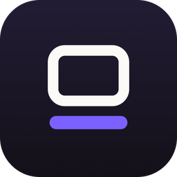
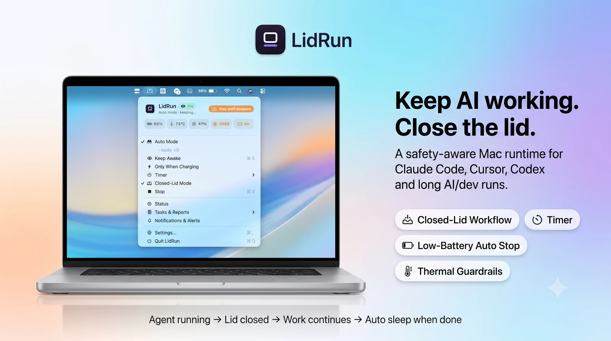
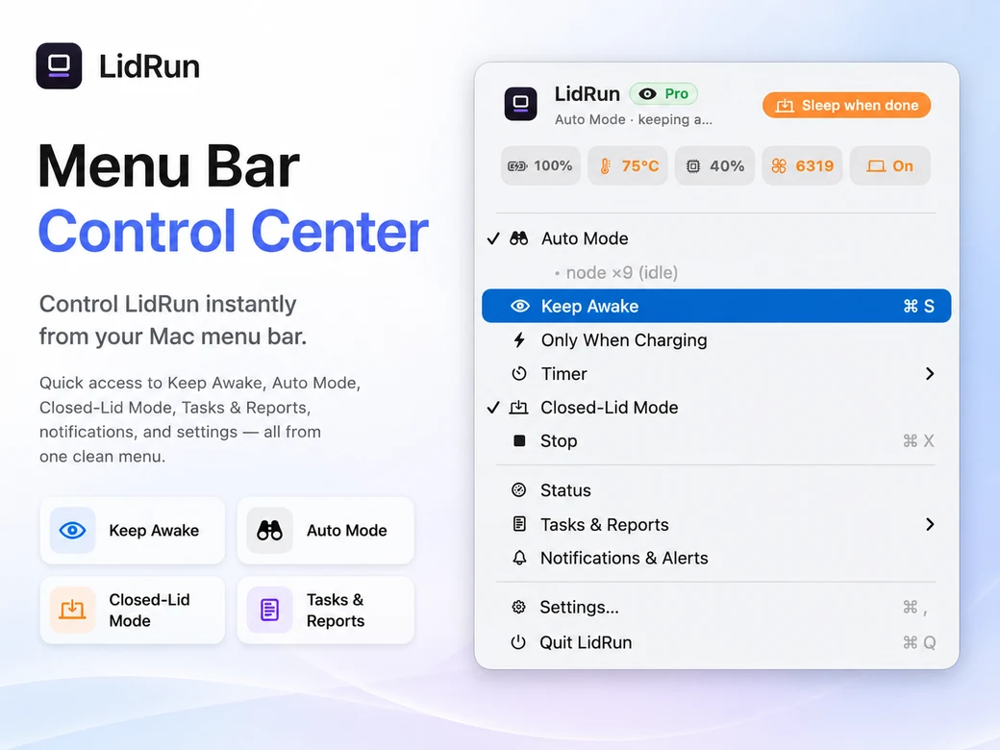
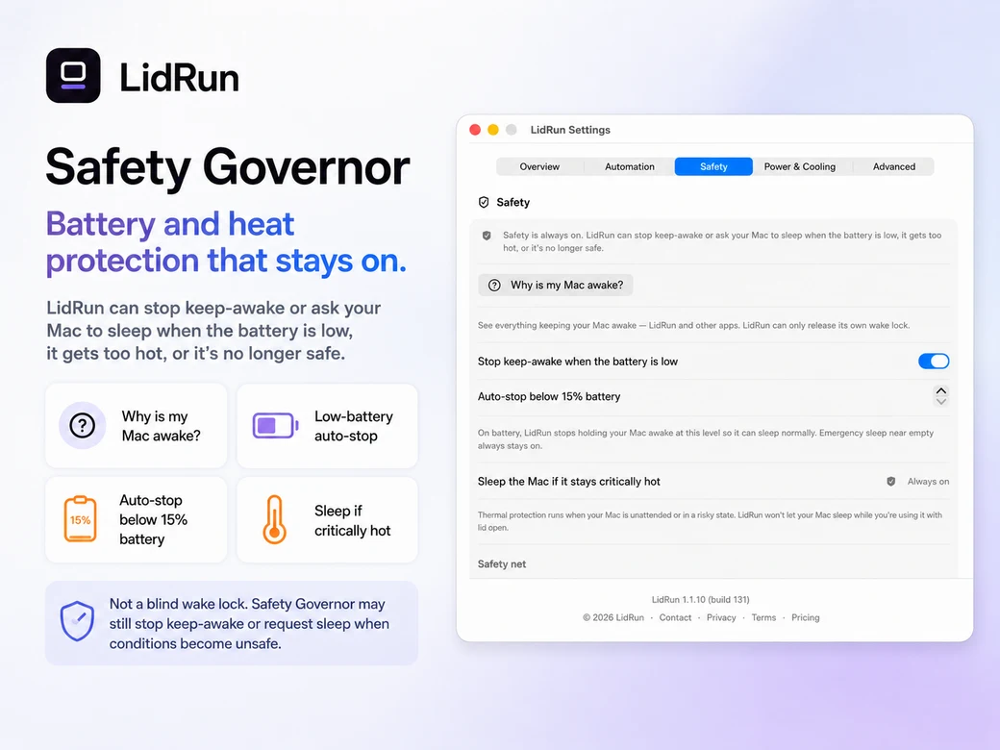

# LidRun — keep your Mac awake with the lid closed

**Close the lid. Keep the run alive.** LidRun is a macOS menu-bar app that [keeps your Mac awake](https://lidrun.com) — even with the lid shut — so Claude Code, Cursor, Codex, Docker and Ollama keep running while you step away. It releases the Mac automatically when the work is done or when battery/thermal limits are reached.

&nbsp;

---

## What it does

- **Keeps your Mac awake with the lid closed** — a guarded [clamshell mode](https://lidrun.com), no external display required.
- **Detects your workloads** — it only holds the Mac awake while real AI/dev work is running (Claude Code, Cursor, Docker, Ollama and 50+ tools), then lets the Mac sleep when the job ends.
- **Safety-first** — session timers, charging-only mode, a low-battery stop, and thermal monitoring. It reduces risk; it does not remove physics — keep the Mac ventilated.
- **Why Awake / Why Stopped** — always shows *what* it is protecting, *why* your Mac is awake, and *why* it stopped. No blind wake locks.

> **The problem it solves:** you hand a long job to an AI agent, close the MacBook to go home — and macOS puts the Mac to sleep, killing the run halfway. The agent didn't crash. Your Mac slept. LidRun fixes that.

## Download & install

LidRun is a signed and Apple-notarized `.dmg` for macOS 13 (Ventura) and later. Three ways to get it:

| Method | How |
| --- | --- |
| **Direct (recommended)** | [**lidrun.com/download**](https://lidrun.com/download) → open the `.dmg`, drag **LidRun** to Applications. |
| **Homebrew** | `brew install --cask aibrickai/lidrun/lidrun`  First time on Homebrew 6+? Trust the tap once: `brew trust aibrickai/lidrun` |
| **GitHub Releases** | Grab `LidRun.dmg` from the [latest release](https://github.com/aibrickai/lidrun/releases/latest). |

First launch shows the standard *"downloaded from the internet"* prompt — click **Open**. LidRun is code-signed with an Apple Developer ID and notarized, so no Privacy & Security workaround is needed. → [Install guide](docs/install.md)

## Features

| | |
| --- | --- |
| 🔒 **Closed-Lid Mode** | Shut the lid, keep the run going. Guarded, with safety limits. |
| 🤖 **Auto Mode** | Watches your workload — awake only while work is actually running. |
| ⏱️ **Session timer** | Cap any run from 30 minutes to 8 hours, then let the Mac rest. |
| 🔋 **Battery & thermal guardrails** | Charging-only mode, low-battery stop, thermal back-off. |
| 🧭 **Why Awake / Why Stopped** | Full transparency on every keep-awake decision. |
| ⌨️ **CLI** | `lidrun -- <command>` keeps the Mac awake for exactly one command. → [CLI docs](https://lidrun.com/blog/lidrun-cli-keep-awake-terminal) |

**Works with:** Claude Code · Cursor · Codex · Docker · Ollama · Python / PyTorch · Node / Vite / webpack · Xcode · long terminal jobs · SSH sessions — and more.

### See it in action

  
  

## Why LidRun (vs. the built-ins)

`caffeinate` is great for a simple terminal session. [Amphetamine](https://lidrun.com/blog/amphetamine-alternative-for-mac) is great for general keep-awake automation. LidRun is built specifically for **AI/dev runs you can leave behind** — it watches the workload, guards a closed-lid session, shows *why* the Mac is awake, and auto-releases when the work finishes or a safety limit is reached. See [LidRun vs. caffeinate](https://lidrun.com/blog/caffeinate-mac-command) and the [buyer's guide for developers](https://lidrun.com/blog/best-mac-keep-awake-app-for-developers).

## Guides

**Guides in this repo:**

*Getting started* — [Install LidRun & open it the first time](docs/install.md)

*Keep your AI/dev tools running (lid closed)* — [Claude Code](docs/keep-claude-code-running.md) · [Cursor](docs/keep-cursor-running.md) · [Docker builds](docs/prevent-mac-sleep-docker-build.md) · [Ollama / local LLMs](docs/keep-ollama-running.md)

*Keep your Mac awake — how-to* — [Keep your Mac from sleeping](docs/keep-mac-from-sleeping.md) · [Keep your Mac awake](docs/keep-mac-awake.md) · [Clamshell mode](docs/clamshell-mode.md) · [From the Terminal (CLI)](docs/keep-mac-awake-terminal.md)

*Compare & safety* — [LidRun vs caffeinate vs Amphetamine](docs/lidrun-vs-caffeinate-vs-amphetamine.md) · [Running your Mac overnight, safely](docs/run-mac-overnight-safely.md)

Full, up-to-date guides live on **lidrun.com** (English):

- 📖 [Keep Claude Code running when the MacBook is closed](https://lidrun.com/blog/keep-claude-code-running-when-macbook-closed)
- 📖 [Keep a Cursor agent running on a Mac](https://lidrun.com/blog/keep-cursor-agent-running-on-mac)
- 📖 [Prevent Mac sleep during a Docker build](https://lidrun.com/blog/prevent-mac-sleep-during-docker-build)
- 📖 [Clamshell mode on a MacBook](https://lidrun.com/blog/clamshell-mode-on-mac)
- 📖 [The `caffeinate` command, explained](https://lidrun.com/blog/caffeinate-mac-command)
- 📖 [Lid-closed developer workflow](https://lidrun.com/blog/macbook-lid-closed-developer-workflow)
- 🛡️ [Safety & guardrails](https://lidrun.com/safety)

## FAQ

**Is LidRun free?**
Yes. LidRun is free forever for simple keep-awake sessions — Keep Awake, timers, charging-only mode and the low-battery stop. You can also try the closed-lid workflow before upgrading to Pro. Pro unlocks the full closed-lid AI workflow. No subscription — [pay once](https://lidrun.com/pricing).

**How do I keep my Mac awake with the lid closed?**
Turn on keep-running, start your task, then close the lid. LidRun holds a power assertion so macOS won't sleep, while battery and thermal conditions stay within the limits you set. Keep the Mac on a hard, ventilated surface. → [Install & first run](docs/install.md)

**Does it work with Claude Code, Cursor and Docker?**
Yes — LidRun detects tools like Claude Code, Cursor, Codex, Docker and Ollama and holds the Mac awake while they're working, then lets it sleep when they stop. → [Keep Claude Code running](docs/keep-claude-code-running.md)

**Is it safe to run overnight with the lid closed?**
LidRun reduces risk with a low-battery floor, thermal monitoring, a timer, charging-only mode and auto-release. It does not remove physics: keep the Mac ventilated and don't run heavy workloads in a bag or an enclosed space. → [Safety](https://lidrun.com/safety)

**Why does macOS warn me when I open LidRun?**
macOS shows a one-time prompt for any app downloaded from the internet. LidRun is signed with an Apple Developer ID and notarized, so a single click on **Open** is all it needs. → [If the app won't open](docs/install.md#if-the-app-wont-open)

**Is there a subscription?**
No. LidRun is a one-time purchase with lifetime updates. The free tier is free forever, with no time limit.

## Alternatives &amp; related projects

LidRun is built for one thing: keeping AI/dev work running through a **closed lid**, with battery/thermal guardrails and automatic release when the job ends. The macOS keep-awake space is friendly and active — if you want something simpler, or fully open-source, these are all worth a look.

**Established keep-awake apps**

- [KeepingYouAwake](https://github.com/newmarcel/KeepingYouAwake) — long-running, open-source Caffeine alternative for the menu bar.
- [Amphetamine](https://apps.apple.com/us/app/amphetamine/id937984704) — the popular free app for general keep-awake with flexible triggers.

**Open-source projects for AI agents &amp; the closed lid**

- [modafinil](https://github.com/narcotic-sh/modafinil) — let your agents run while the MacBook lid is closed.
- [Lidless](https://github.com/nghialuong/Lidless) — menu-bar app to keep a Mac running with the lid closed, for coding agents.
- [aquarium](https://github.com/ZimengXiong/aquarium) — keep agents running "in your bag".
- [cc-caffeine](https://github.com/samber/cc-caffeine) — prevents your computer from sleeping while Claude Code works.
- [Awayke](https://github.com/daemonphantom/Awayke) — keep your Mac awake with the lid closed.
- [StayAwake](https://github.com/TY-teo/StayAwake) — native menu-bar app for AI coding agents (MIT).
- [Macchiato](https://github.com/ObservedObserver/Macchiato) — keep the Mac awake while your code agent works, even with the lid closed.
- [Sleepless](https://github.com/Aboudjem/Sleepless) — MIT keep-awake with a battery-floor cutoff.
- [eclam](https://github.com/jadhvank/eclam) — keeps the Mac awake when it matters, and lets it sleep when it's safer.

Browse more in the [`keep-awake`](https://github.com/topics/keep-awake) topic on GitHub.

## Support

- 🐞 **Bugs / help:** [open an issue](https://github.com/aibrickai/lidrun/issues/new/choose)
- 💬 **Questions / ideas:** [Discussions](https://github.com/aibrickai/lidrun/discussions)
- 🌐 **Everything else:** [lidrun.com](https://lidrun.com)

## Connect

Follow LidRun for release notes, closed-lid tips and behind-the-scenes builds.

  
  
  
  
  

Built by <strong>Henry AGI</strong> — the maker behind LidRun

  
  
  
  

---

LidRun is a closed-source, signed &amp; notarized macOS app. This repository hosts its releases, docs and community support. © LidRun.

