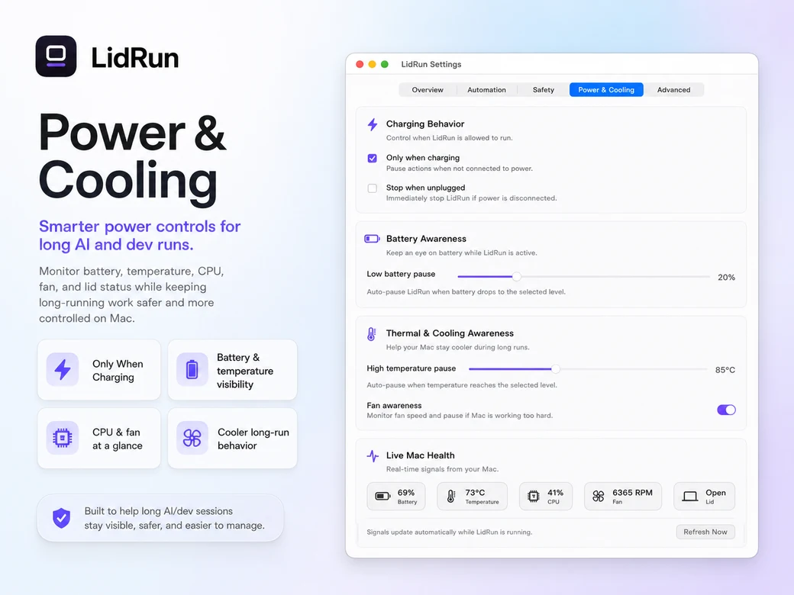

# How to keep your Mac from sleeping

**Short answer:** To keep your Mac from sleeping, either change **System Settings → Lock Screen + Battery** so it never sleeps automatically, or run the built-in **`caffeinate`** command in Terminal. For a single job, `caffeinate -i -- <command>` prevents your Mac from sleeping only until that command finishes, then releases it. For lid-closed or workload-aware sessions, use a dedicated tool.

There is no single "stay awake" switch — the right method depends on whether you want it permanent, per-command, or tied to a workload. Here's every option, from simplest to most advanced.

## 1. System Settings (no Terminal)

The GUI route lives in two places:

- **System Settings → Lock Screen** — set *Turn display off on battery/power adapter when inactive* to a longer interval or **Never**. This stops the *display* from sleeping.
- **System Settings → Battery → Options** — enable **Prevent automatic sleeping on power adapter when the display is off** (on a MacBook; desktops show a similar "Prevent automatic sleeping" toggle). This is the one that keeps the *system* from sleeping.

Good for: leaving a long download or render running at your desk. Downside: it's global and stays on until you remember to turn it off. It also won't survive a closed lid on a MacBook.

## 2. `caffeinate` — the built-in command

`caffeinate` ships with macOS and is the cleanest per-session tool. With no arguments it asserts until you press Ctrl-C. The flags are the useful part:

```sh
caffeinate -i          # prevent idle system sleep
caffeinate -d          # prevent the display from sleeping
caffeinate -m          # prevent the disk from idle-sleeping
caffeinate -s          # prevent system sleep only while on AC power
caffeinate -u -t 300   # simulate user activity for 300 seconds
```

The best pattern is scoping the assertion to a command so it auto-releases:

```sh
# Keep awake for exactly this build, then release
caffeinate -i -- npm run build

# Keep awake while a specific process (by PID) is alive
caffeinate -w 12345
```

`-t <seconds>` sets a timeout; `-w <PID>` ties the assertion to another process's lifetime. Because the assertion ends when the command or PID does, you never leave your Mac awake by accident. For a deeper walkthrough of every flag and real recipes, see the [full `caffeinate` guide](https://lidrun.com/blog/caffeinate-mac-command).

Limitation: `caffeinate` keeps the Mac awake, but on a MacBook it does **not** keep it running with the lid closed.

## 3. `pmset` — the power-management sledgehammer

`pmset` edits your Mac's actual power schedule. It's powerful and mostly a diagnostic tool, but one flag comes up constantly:

```sh
# Inspect current assertions and settings
pmset -g assertions
pmset -g custom

# The one people copy from forums — read the warning below first
sudo pmset -a disablesleep 1
```

`sudo pmset -a disablesleep 1` disables sleep entirely, for **all** power sources, **permanently** — it survives reboots and lid-close. There is no timer, no auto-release, and no reminder. If you forget it, your Mac can run hot in a bag or drain to empty overnight. Always pair it with the explicit undo:

```sh
sudo pmset -a disablesleep 0
```

Treat `disablesleep` as a manual toggle you're responsible for, not a set-and-forget. If you want the closed-lid behavior it enables but with guardrails and automatic release, see this [safer alternative to `pmset disablesleep`](https://lidrun.com/blog/safe-alternative-to-pmset-disablesleep).

## 4. Closing the lid (clamshell without an external display)

By default a MacBook sleeps the moment you close the lid unless it's connected to power *and* an external display/keyboard. To run a job with the lid shut and **no** external monitor, you need something holding `disablesleep` (or an equivalent assertion) for the duration. Doing it by hand means the raw `pmset` toggle above — permanent and global. A guarded tool scopes it to the session and reverses it when the job ends. Background on how clamshell mode actually works: [clamshell mode on Mac](https://lidrun.com/blog/clamshell-mode-on-mac).

## 5. A workload-aware tool that auto-releases

<p align="center"></p>

The gap in every method above is that they don't know when your work is done. [LidRun](https://lidrun.com/download) is a menu-bar app built for exactly this: it holds the standard IOKit power assertions while a workload is running, then releases the Mac when the job ends or a safety limit is hit.

- **Auto Mode** keeps the Mac awake only while your workload is actually working. Known agents — Claude Code, Cursor, Codex, Cline, Aider, Continue, Goose, Ollama, LM Studio — count as working *by presence*, so an agent idling at ~0% CPU while it waits on an API call is never dropped mid-task.
- **Closed-Lid workflow** keeps a job running with the lid shut — guarded, not a blind wake-lock.
- **Session timer** from 30 minutes to 8 hours.
- **CLI**: `lidrun -- <command>` keeps the Mac awake for exactly that command, then releases — the same scoping idea as `caffeinate --`, plus the closed-lid and safety layers.
- **Guardrails**: low-battery stop, charging-only mode, thermal back-off, and Why Awake / Why Stopped transparency so you always know what's holding the Mac open.

It reduces the risk of the "forgot I disabled sleep" scenario, but it doesn't remove physics — keep the machine ventilated when you run it closed. More on the design: [what a safe runtime layer is](https://lidrun.com/blog/what-is-a-safe-runtime-layer).

## Which one should I use?

- **One-off at your desk, lid open:** `caffeinate -i -- <cmd>`.
- **A GUI download you'll babysit:** System Settings toggles.
- **Debugging power behavior:** `pmset -g assertions`.
- **Lid closed, or "keep going while my agent works, then stop":** a workload-aware tool.

## FAQ

**How do I stop my Mac from sleeping in Terminal?**
Run `caffeinate -i` to prevent idle sleep until you hit Ctrl-C, or `caffeinate -i -- <command>` to keep it awake only until that command finishes.

**How do I prevent my Mac from sleeping when the lid is closed?**
A closed lid triggers sleep unless something holds a `disablesleep` assertion. `sudo pmset -a disablesleep 1` does it globally and permanently; a guarded tool like LidRun scopes it to the session and releases it automatically.

**Does `caffeinate` keep the display on?**
Only with `-d`. Plain `caffeinate` and `-i` prevent *system* sleep but let the display turn off. Add `-d` if you need the screen to stay lit.

**Is `sudo pmset -a disablesleep 1` safe to leave on?**
It works, but it's permanent, global, and survives reboots with no auto-release — easy to forget and let the Mac overheat or drain. Undo it with `sudo pmset -a disablesleep 0`, or use a tool that reverses the assertion when your work ends.

*[Download LidRun](https://lidrun.com/download) — free forever for simple sessions; Pro unlocks the full closed-lid AI workflow ([pricing](https://lidrun.com/pricing)).*
